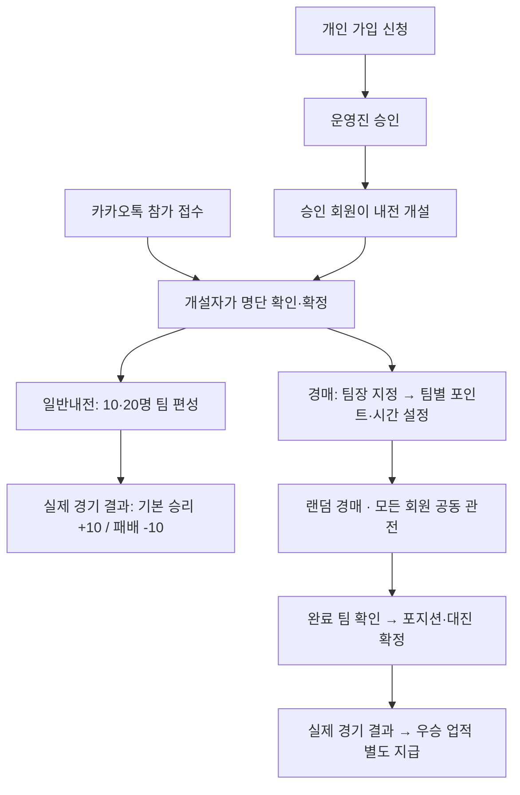

# 현재 운영 흐름과 변경 검토

> 과거 원자료·일회성 스크립트는 사용자의 정리 요청으로 삭제되었습니다. 인라인 경로는 과거 이력 표기이며, 최신 근거는 [Riot 연동 보고](RIOT_API_REPORT.md)에서 확인합니다.

2026-09-08. 이번 변경의 기준 문서입니다. 과거 검토 문서의 ‘회원 승인 후 운영진이 로그인 계정을 별도로 발급’하는 설명은 아래 흐름으로 대체합니다. 기존 회원·전적을 가져오는 기능은 추가하지 않았으며 실제 운영 데이터 삭제도 수행하지 않았습니다.

## 저장 위치를 하나로 통일

운영의 기준 저장소는 Supabase PostgreSQL 하나입니다. 계정·가입 신청·회원·참가 확정 명단·팀·입찰·잔여 포인트·경기·전력점수·우승 업적·감사 기록을 함께 저장합니다. 현재 실행 코드와 의존성에는 구글시트 연결이 없습니다. 과거 추출 문서의 구글시트 설명은 참고 코드의 설명입니다.

카카오톡은 접수 창구이며 확정된 명단은 DB에 등록합니다. Google Sheets 연결·동기화·기존 자료 가져오기는 운영 범위에서 제외합니다. CSV 다운로드는 DB 자료를 파일로 확인하는 기능이며 별도 운영 저장소가 아닙니다. 체험 공간의 SQLite는 예시 자료를 격리하는 용도이며 운영 자료와 합치지 않습니다. 현재 체험 데이터 버전은 **5**로, 제공된 Riot ID 22명과 성공한 21명의 공개 조회 스냅샷을 사용합니다. 체험 점수·클랜 티어·경기는 예시이며 코드가 지원하는 PostgreSQL 스키마 버전 **7**과도 별개입니다. DB 연결 설정이 잘못됐을 때 다른 저장소로 조용히 넘어가지 않습니다.

기본 운영 실행은 Supabase 연결 정보가 없거나 모두 비어 있어도 중단합니다. `ROLYMOLY_DATABASE_TARGET`에 SQLite 파일을 지정하거나, 대상 지정 없이 `ROLYMOLY_DATA_DIR`를 명시한 경우만 로컬 개발·검증 예외로 허용합니다. 실행기는 선택한 저장소를 화면과 마감 워커에 동일하게 전달합니다.

같은 DB 안에서 계정·회원·참가 명단·팀·입찰·경기·점수 이력·업적을 역할별 테이블로 나눕니다. 일반내전과 경매가 서로 다른 회원 원본을 갖지 않도록 회원 ID로 연결하고, 경기 당시 정보는 참가 명단과 경기 기록에 보존합니다.

## 회원 정보와 로그인 연결

회원 목록은 각 회원 행의 ‘프로필 상세보기’ 버튼으로, 라운지는 회원 카드 클릭으로 같은 프로필에 이동합니다. 승인 회원은 본인 프로필·내 계정에서 Riot ID를 변경할 수 있습니다. 주·부 포지션과 클랜 티어는 관리자에게 변경을 요청하며, 관리자는 ‘회원 정보 수정’ 또는 운영 관리에서 같은 저장 기능을 사용합니다.

| 데이터 | 저장·수정 기준 |
| --- | --- |
| 로그인 아이디·회원 ID | 계정과 회원을 연결하는 고정 기준. Riot ID를 변경해도 로그인 아이디·연결 ID는 유지 |
| Riot ID | 가입 때 입력하고, 승인 후에는 본인 닉네임 변경 또는 관리자 수정. 회원 ID·로그인 연결 유지 |
| 주·부 포지션 | 가입 시 각각 입력하고 승인 후에는 관리자만 수정. Riot API가 덮어쓰지 않음 |
| 클랜 티어 | 운영진의 내부 평가. 관리자만 수정하는 32자 이내 선택적 명칭 |
| 현재 솔로랭크·LP | `member_ranks`의 `SOLO` 행. Riot 수동 갱신으로 저장하고 미조회는 미입력으로 표시. 기존 수동 값은 출처를 구분해 보존 |
| 현재 자유랭크·LP | `member_ranks`의 `FLEX` 행에 티어·단계·LP·승패·출처·조회 시각을 별도 저장. 솔로랭크를 덮어쓰지 않음 |
| 주력 챔피언 | Riot 챔피언 숙련도 상위 5개. 실제 숙련도 점수·레벨을 표시하며 승률로 환산하지 않음 |
| 전력점수 | 기존 기본점수 + 일반내전 증감 + 운영진 수기 보정. 티어 변경만으로 자동 재계산하지 않음 |
| 우승 업적 | 별도 업적 원장에서 관리. 티어·점수와 별개 |
| 과거 신청 메시지 | `application_notes`에 보존. 최신 가입·보완 화면에는 메시지 입력란을 두지 않으며 내부 메모와 합치지 않음 |
| 내부 운영 메모 | `notes`. 관리자만 확인·수정. 기존 혼합 메모는 여기에 보존하며 신청 메시지로 자동 복사하지 않음 |

회원 정보 변경에는 사유·처리자·전후 값이 남습니다. 회원 Riot ID 변경과 계정 표시 이름 갱신을 같은 트랜잭션으로 처리합니다. 두 관리자가 같은 이전 정보를 수정하면 한 번만 저장되고, 다른 화면은 최신 정보를 다시 불러와야 합니다. 가입 신청의 본인 수정에도 같은 버전 확인을 적용합니다. 탈퇴·복귀 후에도 옛 화면으로 덮어쓸 수 없습니다.

일반내전 생성·명단 재편성, 경매 참가 명단 확정 시 당시 Riot ID·클랜 티어·현재 티어·LP·포지션·전력을 저장합니다. 이후 회원 원본을 수정해도 이미 확정된 명단과 경기 기록의 당시 정보는 유지합니다. 다음 새 내전은 변경한 회원 정보를 사용합니다. 과거 기록에 저장되지 않은 티어를 현재 값으로 추측해 채우지 않습니다.

회원 목록·내 계정은 현재 회원 정보를 보여주며 내전 명단·경기와 해당 CSV는 저장된 당시 이름·티어를 사용합니다. 현재 회원 정보와 과거 기록의 표시가 다른 것은 DB 연결이 끊긴 현상이 아닙니다. 새로 입력하지 않은 값과 과거에 저장되지 않은 값도 구분합니다.

Riot 랭크는 같은 Supabase DB의 `member_ranks`, 이미지·숙련도 등 프로필 정보는 `riot_profiles`에 저장합니다. 개인 프로필의 ‘갱신하기’ 또는 내전 준비 화면의 ‘이 회원 갱신’을 누를 때만 요청합니다. 화면 진입·검색·자동 재실행은 새 조회를 예약하지 않으며, 명시적으로 예약한 작업은 제한 대기 후 이어갑니다. 경매 카드의 현재 티어·주력 챔피언은 저장된 최신 Riot 정보이고 클랜 티어·전력은 확정 명단 기준입니다. 경기 기록의 당시 티어는 API 조회로 덮어쓰지 않습니다.

체험 공간은 제공한 22개 Riot ID와 미리 조회한 공개 티어·숙련도를 사용합니다. 클랜 티어는 실제 티어에서 한 단계 위 또는 두 단계 아래로 최초 생성 때만 정한 예시 평가이며, 전력·포지션·내전 결과도 체험용입니다. 운영 회원 평가는 이 무작위 규칙을 사용하지 않습니다. 배포 전에는 `[riot] allow_demo = true`로 체험의 개인 갱신을 허용하고, Cloud 배포용 설정에서는 false로 바꿉니다. 기본값은 false입니다. 체험 데이터와 운영 회원 데이터를 합치지 않으며, 허용된 체험 요청도 운영과 동일한 Supabase 요청 한도를 사용합니다.

`riot_jobs`는 단계별 조회와 재시도를 보존하고, `riot_rate_hits`·`riot_rate_cooldowns`는 키별 호출 수와 대기 시간을 관리합니다. 1초 20회·120초 100회 이내로 제한하며 429 응답의 지정 시간 동안 기다립니다. API 요청은 경매 화면이나 입찰 트랜잭션에서 실행하지 않습니다. 조회 실패 시 마지막 정상 정보를 유지합니다. Riot ID 변경은 이전 랭크·프로필 캐시·작업을 무효화하며 로그인 연결·전력·기존 기록을 바꾸지 않습니다. 코드가 지원하는 스키마는 v7이며 [전체 구현 보고서](docs/ROLYMOLY_IMPLEMENTATION_REPORT.md)에 현재 검증 상태를 구분합니다.

수동 점수 보정은 UUID별 처리 영수증을 별도 `score_adjustment_requests` 테이블에 저장합니다. 같은 요청이 다시 오면 기존 원장 번호를 반환하고 추가 반영하지 않습니다. 같은 UUID로 금액·대상·사유·관리자를 바꾸면 거절합니다. 수동 점수·업적 입력 화면도 처리 요청별로 구분해 이미 제출한 화면의 재전송으로 새 보상이 생기지 않도록 합니다.

일반내전·경매 생성도 요청 UUID와 생성 내용을 `competition_creation_requests`에 함께 보관합니다. 응답을 받지 못해 같은 요청을 재전송하면 같은 내전을 반환하며 내용·개설자·종류를 바꿔 키를 재사용할 수 없습니다. 명단 확정은 조회 당시 버전을 비교하는 CAS 검사로 보호합니다. 명단 편집 내용이 남아 있거나 다른 창에서 명단이 바뀌었다면 최신 저장 내용을 확인한 뒤 확정합니다.

## 가입과 권한

1. 회원가입에서 로그인 아이디·비밀번호와 확인·Riot ID·주 포지션·부 포지션을 입력하고 운영 절차 확인을 체크합니다. 현재 티어·LP·신청 메시지는 입력하지 않으며 계정·회원·신청서를 한 트랜잭션으로 저장합니다.
2. 가입 대기 중에도 같은 계정으로 로그인해 본인의 신청을 확인·수정할 수 있습니다. 거절 사유를 확인하고 재신청할 수 있으며 승인 전 내전 개설·입찰은 차단됩니다.
3. 관리자가 카카오톡과 신청 정보를 확인하고 기본 전력점수를 정해 승인합니다. 기존 신청 계정을 그대로 활성 회원으로 사용합니다.
4. 승인된 모든 회원이 일반내전·경매를 개설할 수 있습니다. 개설자는 본인이 만든 내전만 진행하며 관리자는 전체를 관리합니다.
5. 참가 신청은 계속 카카오톡에서 받습니다. 개설자가 검색 또는 정확한 Riot ID 명단 붙여넣기로 회원을 선택하고 포지션·정원을 확인합니다. 웹 참가 신청·출석·대기열은 두지 않습니다.

카카오톡 명단은 **카카오톡 명단 붙여넣기 → Riot ID 명단**에 여러 줄로 입력하고 미리보기를 확인한 뒤 선택에 반영합니다. `1. 닉네임#태그 / 티어 / 포지션`처럼 앞의 번호를 제거하고 첫 `/` 앞의 Riot ID만 읽습니다. `8.경먀#kr1/d2/정글`처럼 순번 뒤 공백이 없어도 `경먀#KR1`로 추출합니다. 20~40명 명단도 회원 DB의 정확한 Riot ID와 대조하며 미등록·중복·승인 전 회원을 따로 표시합니다. 붙여넣은 티어·포지션은 회원 원본을 덮어쓰지 않습니다. 선택한 회원의 경기 배정 포지션은 기존 표에서 확인·수정합니다.

| 사람 | 할 수 있는 일 | 제한 |
| --- | --- | --- |
| 가입 대기·보완 요청 회원 | 본인 신청 확인·수정·재신청, 비밀번호 변경 | 내전 개설·입찰·운영 화면 접근 불가 |
| 승인 회원 | 일반내전·경매 개설, 공동 관전, 기록 조회 | 타인이 만든 내전 운영 불가 |
| 해당 내전 개설자 | 명단 확정·팀장 지정·경매 진행·결과 입력·종료 | 관리자용 수기 점수·낙찰 정정 권한 없음 |
| 해당 경매 팀장 | 본인 계정에서 그 팀의 입찰 | 다른 경매·다른 팀으로 입찰 불가 |
| 진행자 역할을 부여받은 승인 회원 | 같은 개인계정으로 진행자 기능 사용 | 회원 연결을 바꾸지 않으며 탈퇴 중에는 역할 사용 불가 |
| 관리자 | 전체 운영, 가입 승인·거절, 계정 복구, 감사 이력이 남는 정정 | 관리자라는 이유로 다른 팀 대신 입찰할 수 없음 |

팀장은 회원의 영구 직급이 아닙니다. 경매마다 지정하며 진행 중 교체는 허용하지 않습니다. 한 회원이 경매 A에서는 팀장, 경매 B에서는 일반 참가자일 수 있습니다. 직접 가입한 계정과 회원의 연결은 고정합니다. 운영진도 승인된 개인계정에 진행자·관리자 역할을 부여해 사용하며, 관리자 화면에서 별도 회원계정을 발급하거나 회원 연결을 바꾸지 않습니다. 기존 계정의 재연결 API는 호환용으로 남아 있지만 진행 중 참가자 연결은 차단하고, 허용된 변경도 기존 세션·복구 코드를 폐기합니다.

탈퇴하면 해당 회원의 모든 역할에서 로그인·입찰·운영 접근이 중단됩니다. 마지막 활성 관리자는 비활성화·강등·탈퇴 처리할 수 없습니다. 관리자가 복귀시킨 뒤 승인 이력이 있는 회원은 기존 역할로 다시 로그인할 수 있으며, 계정 자체를 별도로 비활성화했다면 활성 상태도 확인해야 합니다.

## 일반내전과 경매

경매 선수 순서는 서버가 무작위로 정해 저장합니다. 새로고침이나 시간·포인트 설정 재저장으로 다시 추첨하지 않습니다. 현재 라운드의 선수가 모두 끝나고 유찰자가 남으면 개설자·관리자가 **유찰 재시작**을 누릅니다. 유찰 대상을 다시 섞어 저장하고 3초 준비 후 재경매합니다. 현재 라운드가 끝나기 전에는 유찰 선수를 끼워 넣지 않습니다. 예산 기준은 저장된 전력점수이며 경매 시작 전에 팀별 조정할 수 있습니다.

입찰 시간은 5·10·15·20·25·30초 중 선택합니다. 기본 10초, 유효한 새 입찰마다 남은 시간에 5초를 더하되 선택한 시작 시간이 상한입니다. 10초 설정에서 1→6초, 2→7초, 7→10초입니다. 낙찰·유찰 뒤 다음 선수 준비는 3초입니다. 거절·중복 요청에는 연장을 적용하지 않습니다.

개인 입찰은 흰 입찰 카드에서 금액과 제출 버튼을 함께 확인합니다. 개설자·관리자의 **일시 정지·경매 재개** 버튼은 진행 화면 상단의 **현재 경매** 영역에 유지합니다. 일시정지는 유찰 재시작과 다른 동작이며, 멈춘 라운드를 재개했다고 유찰 순서를 다시 섞지 않습니다.

상단에는 현재 → 다음 선수와 오른쪽 스피커·음량 조작부를 두고, 왼쪽 화살표로 모든 팀을 순환 조회합니다. 다른 팀을 보고 있어도 입찰은 본인의 고정 팀으로만 접수됩니다. 전체 팀 현황은 배정 포지션별로 표시하며 같은 포지션 선수가 여럿이어도 누락하지 않습니다. **금액 초기화**는 입력값만 현재 최고가로 되돌리고 DB 입찰·잔여 포인트·마감을 변경하지 않습니다.

**경매 초기화**는 설정이 저장된 준비 상태, 진행 중, 대진 생성 전 완료 상태에서 주최자·관리자가 환불·잔여 포인트 미리보기와 사유를 확인한 뒤 실행합니다. 참가자·고정 팀장·시작 예산·입찰 시간은 보존하고, 낙찰 배정을 되돌려 환불한 뒤 선수 순서를 새로 섞어 시작 대기로 돌아갑니다. 대진·실경기·우승 보상이 생긴 뒤에는 차단합니다. 초기화·취소 전 입찰은 별도 접힌 기록에 보존하고 현재 입찰 목록과 효과음 대상에서 제외합니다. [화면·정책 대응표](AUCTION_REFERENCE_MAPPING.md)

경매 입찰 포인트와 회원 전력점수는 별개입니다. 경매 경기에는 전력점수 증감이 없고 실제 우승팀에게 업적만 지급합니다. 일반내전은 개설 당시 정책을 실제 경기별로 적용합니다. 수기 조정·결과 정정·우승 보상을 별도 원장에 남깁니다.

## 흐름이 달라졌을 때의 처리

| 상황 | 처리·복구 |
| --- | --- |
| 신청서를 검토하는 중 신청자가 내용 변경 | 이전 화면의 승인·거절을 차단합니다. 최신 신청을 불러오면 점수·메모·사유를 다시 입력해 확인합니다. |
| 명단에 미가입·미승인·중복 이름 포함 | 붙여넣기 미리보기에서 표시하고 자동으로 다른 회원과 연결하지 않습니다. 카카오톡에서 정확한 Riot ID와 가입 승인을 확인합니다. |
| 다른 창에서 명단·팀·대진 변경 | 오래된 화면의 저장을 거절합니다. ‘최신 명단 불러오기’로 확인한 뒤 다시 편집합니다. |
| 내전 생성 응답 유실·버튼 중복 제출 | 같은 UUID와 같은 내용으로 재시도하면 이미 만든 내전을 반환합니다. 다른 내용은 새 요청으로 생성합니다. |
| 일반내전 첫 경기 전 참가자 변경 | 정원을 유지해 명단을 재확정하면 같은 내전의 팀과 대진을 한 번에 다시 편성합니다. 이미 경기 기록이 있으면 재편성을 차단합니다. |
| 결과 폼을 열어 둔 사이 팀·명단·대진 변경 | 결과 저장을 차단하고 최신 경기를 다시 확인합니다. 첫 결과 저장과 명단 재편성이 겹쳐도 두 작업이 모두 옛 화면 기준으로 저장되지 않습니다. |
| 동시·중복 입찰 | 서버가 권한·대상·금액·잔여 포인트·정원·마감·요청 ID를 같은 저장 작업에서 검사합니다. 같은 금액 경쟁은 먼저 유효하게 저장된 한 건만 접수합니다. |
| 입찰 응답 유실 | 제출 당시 계정·선수·금액·요청 ID를 고정해 접수 영수증을 자동 확인합니다. 확인 중 새 입찰은 막고, 접수가 없다고 확정되면 현재 금액·마감을 다시 확인해 수동 제출합니다. 중복 차감·시간 연장을 하지 않습니다. |
| 잘못된 낙찰 | 일시정지 → 관리자가 사유 입력 → 환불·새 팀·가격 미리보기 → 정정 확정 → 상태 확인 후 재개합니다. 미리보기 이후 상태가 바뀌면 다시 확인해야 합니다. |
| 완료된 경매의 낙찰 취소 | 대진 생성 전까지만 허용합니다. 완료 상태에서 일시정지된 경매로 돌아가며 개설자가 재개하면 3초 후 재경매합니다. 대진·경기 생성 후에는 낙찰 명단을 고치지 않습니다. |
| 경매 전체를 다시 시작 | 주최자·관리자가 경매 초기화 미리보기와 사유를 확인합니다. 같은 요청 재시도는 한 번만 반영하고, 미리보기 뒤 입찰·배정이 바뀌면 최신 상태를 다시 확인합니다. 대진 생성 후에는 차단합니다. |
| 초기화 창을 여는 동안 DB 연결 실패 | 안전한 오류 안내와 기존 경매 상태를 유지합니다. 연결이 회복된 뒤 다시 열며, 오류 원문이나 연결 비밀값을 표시하지 않습니다. |
| 팀장이 로그인하지 못함 | 경매를 일시정지하고 관리자가 본인 확인 후 30분 유효 일회용 복구 코드를 발급합니다. 새 비밀번호로 로그인한 뒤 재개합니다. 계정을 다른 회원에 연결하지 않습니다. |
| 회원 탈퇴 처리 | 진행 중인 내전·경매와 팀장 여부를 먼저 확인합니다. 저장 시 회원 상태 버전을 재확인하며 세션과 복구 코드를 폐기합니다. 기존 명단·경기 기록은 삭제하지 않습니다. |
| 탈퇴 회원 복귀 | 최초 승인과 별도 처리합니다. 승인 이력이 있으면 `APPROVED`, 미승인 신청자는 `PENDING`으로 돌아갑니다. 거절된 신청은 `REJECTED`를 유지해 같은 계정에서 보완·재신청하게 합니다. 점수·내부 메모는 유지합니다. |
| 새로고침·재접속 | 같은 브라우저 탭에 저장된 토큰을 서버에서 재검증합니다. 만료·로그아웃·비밀번호 변경으로 폐기된 토큰은 복원하지 않습니다. 브라우저 저장소가 차단되거나 탭을 닫은 경우 다시 로그인합니다. |
| 창을 열어둔 뒤 계정·권한 변경 | 생성·명단·회원 수정 창에서도 현재 세션과 권한을 다시 확인합니다. 이전 계정의 제출이나 회수된 관리자 권한으로 내부 메모를 조회할 수 없으며, 현재 계정으로 창을 다시 열어 진행합니다. |
| 경기 후 운영 중단 | 기록을 삭제하거나 참가자를 바꾸지 않고 관리자 중단 종료 기능으로 기존 경기·점수·낙찰을 보존합니다. |

비밀번호 계산은 DB 쓰기 잠금을 잡기 전에 수행하고 저장 직전에 계정 상태를 재확인합니다. 로그인과 입찰이 같은 DB를 사용해도 느린 비밀번호 계산 전체가 입찰을 막지 않도록 변경했습니다. 짧은 저장 작업끼리의 대기는 여전히 생길 수 있습니다.

## 누적 요청과 현재 구현 확인

아래는 소스에 구현된 기능과 미완료 운영 작업을 구분한 표입니다. ‘구현’ 표시는 이번 전체 회귀 통과나 실제 브라우저·Cloud 배포 완료를 뜻하지 않습니다.

| 요청 | 현재 상태 | 소스 근거 |
| --- | --- | --- |
| DB 하나로 관리, 구글시트 제거 | 구현. 공통 DB를 회원 ID로 연결하며 기본 운영 설정 누락 시 중단 | [저장소 선택](roly/storage_config.py), [공통 서비스](roly/ui.py) |
| 모든 회원의 개인 로그인·운영 역할 | 구현. 가입·승인 후 같은 계정 사용, 승인 회원에게 운영 역할 부여, 회원 연결 고정 | [가입·본인 정보](roly/auth.py), [권한·복귀](roly/core.py) |
| 일반 회원도 일반내전·경매 개설 | 구현. 승인 회원은 개설 가능, 자기 내전만 진행, 관리자는 전체 관리 | [권한 검사](roly/auth.py), [일반내전](roly/competition.py), [경매 준비](roly/tournament.py) |
| 일반내전 승리 +10·패배 −10 | 구현. 초기 정책 ±10, 개설 당시 정책 고정, 수기 보정과 별도 원장 | [정책·경기 원장](roly/core.py) |
| 경매 전력 유지·우승 업적 | 구현. 경매 경기 점수 증감 0, 우승팀 보상은 별도 원장에 한 번 | [점수·업적](roly/core.py), [종료 처리](roly/competition.py) |
| 랜덤 선수 순서 유지 | 구현. 무작위 순서를 DB에 저장하며 새로고침으로 재추첨하지 않음 | [실시간 경매](roly/live_auction.py) |
| 5~30초·입찰 +5초·선택 시간 상한 | 구현. 5초 단위 6개 선택, 거절·중복 입찰은 연장 없음 | [시간 상수·입찰 검사](roly/live_auction.py) |
| 다음 선수·재경매 3초 준비 | 구현. 준비 중 입찰 차단, 유찰 재시작도 3초 후 진행 | [마감·재경매](roly/live_auction.py) |
| 입찰 효과음·음량 조절 | 구현. 사용자 활성화 후 재생, 0~100%와 0% 무음. 실제 기기 확인은 별도 | [음량 컴포넌트](roly/auction_components.py) |
| 현재·다음 선수·팀 화살표·포지션별 전체 현황 | 구현. 저장된 무작위 순서 표시, 모든 팀 순환 관전, 같은 배정 포지션 선수도 전원 유지 | [경매 컴포넌트](roly/auction_components.py), [화면 연결](roly/auction_ui.py) |
| 상단 경매 초기화·입찰 금액 초기화 | 구현. 경매 초기화는 미리보기·사유·중복 방지로 환불 후 시작 대기, 금액 초기화는 입력값만 변경 | [초기화 서버 검사](roly/live_auction.py), [확인 창](roly/auction_ui.py) |
| 입찰 반응 속도·시간 표시 | 구현. 금액 조작은 로컬 처리, 선수·금액·UUID를 고정해 제출하고 응답 확인 후 다음 조회. DB 묶음 조회·왕복 시간 보정·같은 마감의 표시 증가 방지. 실제 Cloud 검수는 별도 | [통합 패널](roly/auction_live_panel.py), [명령 검증](roly/auction_commands.py), [DB 조회](roly/live_auction.py) |
| 일시정지 버튼 위치 유지 | 구현. 상단 ‘현재 경매’ 영역에서 일시 정지·재개 | [경매 진행 화면](roly/auction_ui.py) |
| 전원 유찰·유찰 반복 재시작 | 구현. 현재 라운드 종료 후 유찰 전원을 재추첨, 반복 라운드 지원 | [재경매 서버 검사](roly/live_auction.py), [유찰 재시작 버튼](roly/auction_ui.py) |
| 흰 입찰 카드 | 구현. 현재 선수·입찰 영역과 우측 입찰 기록에 흰 배경, 진한 금액·팀장·시각 표시. 모바일 실측은 별도 | [입찰 화면](roly/auction_ui.py), [스타일](static/app.css) |
| 진행 현황 표의 낙찰 포인트 | 구현. 상태 앞 열에 확정 낙찰가 표시, 0 P와 미확정·유찰의 — 구분. 재경매 시도별 상태와 연결 | [경매 진행 표](roly/auction_ui.py) |
| 카카오톡 번호·슬래시 명단 20~40명 | 구현. 순번·첫 슬래시 뒤 메모 제외 후 정확 일치, 원문·추출 ID·오류 사유 미리보기. `8.경먀#kr1`처럼 순번 뒤 공백이 없어도 처리 | [명단 입력](roly/roster_ui.py) |
| 생성 UUID·명단 확정 충돌 방지 | 구현. 같은 생성 요청 한 번, 확정 당시 명단 버전 확인 | [생성 영수증](roly/competition.py), [명단 확정](roly/tournament.py) |
| 현재 회원 정보·당시 티어 CSV | 구현. 현재 프로필과 확정 명단·경기의 당시 값을 구분 | [회원 프로필](roly/member_profile.py), [기록·CSV](app_pages/events.py) |
| 사이드바·일반내전/경매 기록 탭 | 구현. 왼쪽 공통 메뉴와 경기 기록의 종류별 탭 유지 | [내비게이션](roly/ui.py), [기록 탭](app_pages/events.py) |
| 라운지 원본 이미지·클랜원 스크롤·우승기호 | 구현. 제공한 포스터 한 장, 전체 회원 검색·최대 480px 내부 스크롤, 우승기호 표시. 회원 카드의 MBTI·소개글 제거 | [라운지](app_pages/home.py), [회원 카드](roly/member_cards.py) |
| 모임 일정·출석 기능 제외 | 화면에서 제외. 경매의 예정 일정과 실제 경기 기록은 유지 | [라운지](app_pages/home.py), [경매 준비](app_pages/auction.py) |
| 앱 휴면 중 독립 마감 | 미구현. 현재 Python 워커는 실행 중인 앱·서버에 의존 | [워커](roly/live_auction.py), [실행기](roly/server.py) |
| 운영 DB 백업·복원 | 앱 스키마 백업·새 QA 스키마 복원 도구와 실제 QA 검증 완료. 예약·외부 보관·운영 덮어쓰기 복원 절차는 별도 | [배포 과제](DEPLOYMENT.md) |
| GitHub·Cloud 배포, 여러 기기 검수 | 기존 검수 앱 배포 완료. 이번 수정본의 전체 회귀·재배포·기기별 검수는 과거 결과와 구분 | [현재 검증 상태](docs/ROLYMOLY_IMPLEMENTATION_REPORT.md), [배포 상태](DEPLOYMENT.md) |

## 검증 범위와 남은 배포 검증

**307개 검증 완료 기록은 v5 개선 전, 스키마 v4 시점의 결과입니다.** 당시 전체 실행 303개 통과 후 회원표 검증 4개를 수정·재실행해 통과했으며 앱·백엔드는 두 실행 사이 변경하지 않았습니다. 당시 Supabase 회원·일반내전 16단계, 일반·경매 17단계, 예외 11단계, v2·v3→v4 구조 추가 11단계와 SQLite 규모별 리허설도 과거 근거로 보존합니다.

이전 v5판은 전체 회귀 366개를 한 번의 실행에서 모두 통과했고, 성능 개선 후 원격 리허설 58단계도 다시 통과했습니다. 소스·스타일·설정 96개 파일(그중 Python 88개)의 실행 중 해시 변경은 없었습니다. **현재 v7과 최신 경매 UI의 검증은 별도**이며 [전체 구현 보고서](docs/ROLYMOLY_IMPLEMENTATION_REPORT.md)를 기준으로 확인합니다. 과거 `test-artifacts/member-db-verification.json`이나 브라우저 리허설을 현재 소스의 전체 통과·실제 브라우저 검증으로 대체하지 않습니다. 검수는 합성 자료와 별도 QA DB를 사용하며 GitHub·Cloud 배포와 구분합니다.

진행 중 경매의 금액 조작은 브라우저에서 처리하고 최종 제출만 선수·금액·UUID가 고정된 명령으로 보냅니다. 통합 패널은 앞선 응답을 받은 뒤 보통 350ms 후 다음 조회를 요청하며, 접수 확인 중에는 같은 명령만 전달합니다. 응답이 끊기면 대기 시간을 늘려 복구합니다. 고정 0.5초 자동 재실행은 제거했고 전체 팀 팝업·시작 대기 감시는 1초 조회를 유지합니다. 이는 별도 웹소켓 푸시 서버나 응답 속도 보장이 아닙니다.

남은 시간은 DB 서버 시각과 브라우저의 단조 시계·왕복 시간·서버 처리 시간으로 보정합니다. 같은 선수·마감·단계의 늦은 응답으로 시간이 증가하지 않으며 시계 확인 전·연결 지연·표시 0초에는 제출을 막습니다. 최종 접수·마감·낙찰은 서버가 판정합니다. PostgreSQL 조회는 연결 풀과 묶음 전송을 사용하며 권한·입찰 결과를 캐시하지 않습니다. 기기별 배치·탭 복원·음량은 실제 브라우저 검수로 확인합니다. Python 워커가 실행되지 않는 Cloud 절전 중의 독립 마감은 아직 보장하지 않습니다.

현재 코드가 지원하는 PostgreSQL 스키마 버전은 **7**입니다. v6의 회원·계정·원장·Riot 작업·호출 한도는 유지하고 `member_ranks`에 솔로·자유랭크를 분리합니다. 기존 유효 캐시와 마지막 정상 솔로랭크를 한 번 옮기며, 이후 랭크 행을 기준으로 기존 화면의 데이터 형식을 구성합니다. 재초기화로 최신 랭크를 과거 값으로 덮어쓰지 않습니다. 다른 DB·시트의 회원 가져오기와는 별개이며, 새 QA 스키마 검증과 공유 DB의 실제 업그레이드 완료를 구분합니다. [스키마와 검증 상태](docs/ROLYMOLY_IMPLEMENTATION_REPORT.md)

변경판을 적용할 때는 실행 중인 앱 서버를 재시작해 새 코드와 스키마 준비를 반영합니다. 리허설용 회원·경기는 별도 QA DB에만 등록하며, 실제 운영 스키마 적용과 최초 관리자 준비는 [README](README.md)의 비공개 터미널 절차로 확인합니다.
